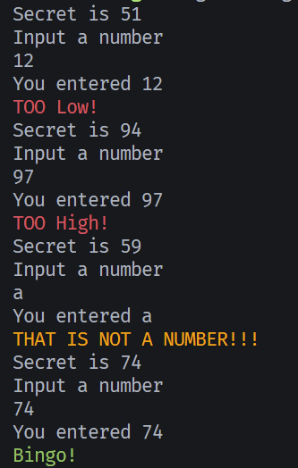

# Guessing Game

A simple number guessing game built in Rust.

## Code Overview

The program generates a random number between 0-100 and asks the user to guess it. It provides feedback whether their guess is too high, too low, or correct. The game loops until the player guesses the right number.

**Key Features:**
- Random number generation using `rand` crate
- User input validation with error handling
- Colored terminal output using `colored` crate
- Match expression for comparison logic

## What I Learned

- **Rust fundamentals**: Variables, loops, and pattern matching
- **Error handling**: Using `match` to handle parsing errors gracefully
- **Crate usage**: Integrating external libraries (`rand`, `colored`)
- **String manipulation**: Reading input and trimming whitespace
- **Type conversion**: Shadowing variables with `parse()` and type inference



## How to Run

```bash
cargo run
```

Enter numbers until you guess correctly!
